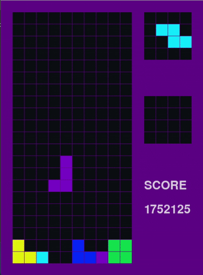

# Tetris AI
## Overview
This project implements a simulated tetris environment, with an AI agent that plays Tetris by taking real-time decisions using the NEAT (NeuroEvolution of Augmenting Topologies) algorithm. The goal is to evolve neural networks that can effectively learn and improve their gameplay over generations. 
<br>
<br>
    
<br>

## Features

- <b>Tetris Environment:</b>  A simulated Tetris game where the AI agent makes decisions.
- <b>NEAT Implementation:</b>  Uses the NEAT algorithm to evolve neural network controllers.
- <b>Real-Time Decision Making: </b>The evolved agent makes gameplay decisions based on the current Tetris board state.
- <b>Fitness Evaluation: </b>The fitness score is evaluated on the basis of gameplay perfomance based on the following features:
    <ul>
      <li>game score</li>
      <li>maximum height of columns</li>
      <li>bumpiness of columns</li>
      <li>gaps in the board and the lines cleared</li> 
    </ul> 
   

## Requirements

- <b>Python 3.7+</b></li>
- <b>Python Libraries:</b>
  <ul>
    <li>pygame</li>
    <li>neat-python</li>
  </ul>

## How to Run
To run the Tetris AI, simply execute the script:
```bash
python runNetwork.py
```
This script initializes the Tetris environment, loads the NEAT-based neural network controller, and starts the simulation. Make sure you have installed all required dependencies(as listed in the Requirements section) before running the script.
## NEAT Implementation in Tetris AI
Our Tetris AI uses the NEAT (NeuroEvolution of Augmenting Topologies) algorithm to evolve neural network controllers that decide the best moves for each falling piece based on board heuristics. Here's a high-level overview of how we implemented NEAT in our Tetris AI:
### 1. Neural Network Controller
- <b>Genome Representation:</b>
    <br>
Each genome represents a neural network configured to evaluate board state.
- <b>Inputs</b>
    <br>
The network receives a vector of six features derived from the current board, including:
    <ul>
        <li>Score</li>
        <li>True gaps (holes)</li>
        <li>Partial gaps</li>
        <li>Maximum height</li>
        <li>Bumpiness</li>
        <li>Number of lines cleared</li>
    </ul>
- <b>Output</b>
    <br>
The network produces a value (or set of values) that effectively represent the “weight” or score of a potential move.
### 2. Move Generation
- We implemented breadth-first search (BFS) in the getAllPossiblePositions(board) function to explore all possible legal positions (defined by x, y coordinates and rotation) that the current piece can occupy.
- For each possible position, a corresponding move sequence (e.g., ["Left", "RotateACW", "Down"]) is stored.
- The AI then uses the neural network (via the getBestMoveSequence(board, network) function) to simulate the subsequent moves and evaluate the board states using the heuristic features.
### 3. Decision-Making Process
- The AI evaluates the quality of each move sequence by:
  <ul>
      <li>Simulating the move sequence on a deep copy of the board.</li>
      <li>Applying the move, to place the piece, and updating the board (e.g., clearing lines).</li>
      <li>Calculating the board’s heuristic parameters using a custom heuristics module.</li>
      <li>Activating the neural network with these parameters to compute a fitness score.</li>
  </ul>
- The move sequence yielding the highest score is selected and executed.
### 4. Game Modes
- Fast Mode:
      <br>
      In fast mode, the AI immediately places pieces using the best move sequence determined by the neural network. This mode is used for efficient training and evaluation.
- Step-By-Step-Mode:
      <br>
      When not in fast mode, moves are executed incrementally (simulating key presses like Left, Right, Down, RotateCW, and RotateACW) so the process can be visualized step-by-step.
### 5. Training and Execution
- The NEAT training process evolves a population of neural networks over generations. The best-performing network is saved to the disk (using Python’s pickle).
- In our final game run (via runGame()), the saved network is loaded, and the AI uses it to play Tetris, updating the board and scoring in real time.
- The evolution and evaluation are orchestrated in functions such as eval_genomes() (for training) and game() (for actual gameplay).
